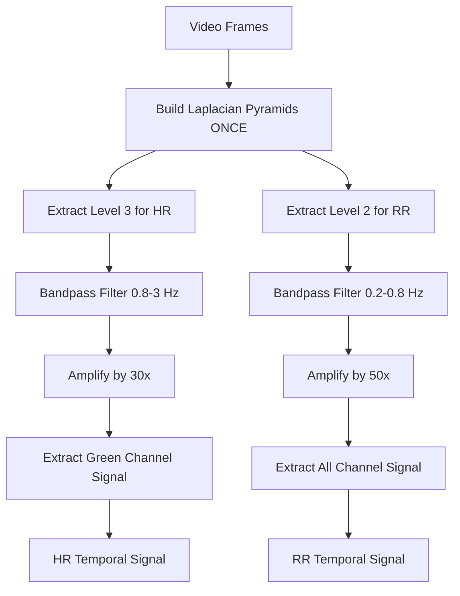

## Overview

The `EVMProcessor` class implements the core Eulerian Video Magnification algorithm with an optimized dual-band processing approach. It builds Laplacian pyramids once and processes both heart rate and respiratory rate frequency bands simultaneously.

## EVMProcessor Class

```python
from src.evm.evm_core import EVMProcessor

# Initialize processor with custom parameters
processor = EVMProcessor(levels=3, alpha_hr=30, alpha_rr=50)

# Process video frames
hr_signal, rr_signal = processor.process_dual_band(video_frames)
```

### Constructor

```python
EVMProcessor(levels=LEVELS_RPI, alpha_hr=ALPHA_HR, alpha_rr=ALPHA_RR)
```

#### Parameters

<ParamField path="levels" type="int" default="3">
  Number of Laplacian pyramid levels to build. Default from `config.LEVELS_RPI`.
  
  - Higher levels capture finer spatial details
  - Typical range: 2-4 levels
  - Level 3 optimal for heart rate
  - Level 2 optimal for respiratory rate
</ParamField>

<ParamField path="alpha_hr" type="float" default="30">
  Amplification factor for heart rate frequency band. Default from `config.ALPHA_HR`.
  
  - Controls signal magnification strength
  - Higher values = stronger amplification
  - Too high may introduce noise
  - Typical range: 20-50
</ParamField>

<ParamField path="alpha_rr" type="float" default="50">
  Amplification factor for respiratory rate frequency band. Default from `config.ALPHA_RR`.
  
  - Respiratory signals are weaker and need higher amplification
  - Typical range: 40-100
</ParamField>

## process_dual_band Method

Single-pass EVM pipeline that extracts two temporal signals simultaneously.

```python
hr_signal, rr_signal = processor.process_dual_band(video_frames)
```

### Parameters

<ParamField path="video_frames" type="list | np.ndarray" required>
  List of ROI video frames in BGR format. Minimum 30 frames required for accurate temporal analysis.
</ParamField>

### Returns

<ResponseField name="hr_signal" type="np.ndarray | None">
  Temporal signal for heart rate analysis. 1D array of magnified pixel intensities from the green channel.
  Returns `None` if processing fails.
</ResponseField>

<ResponseField name="rr_signal" type="np.ndarray | None">
  Temporal signal for respiratory rate analysis. 1D array of magnified pixel intensities averaged across channels.
  Returns `None` if processing fails.
</ResponseField>

## Processing Pipeline

The dual-band approach implements a 6-step optimized pipeline:

### Step 1: Build Laplacian Pyramids (Single Pass)

```python
laplacian_pyramids = build_video_pyramid_stack(video_frames, levels=self.levels)
```

<Info>
  **Key Optimization**: Pyramids are built only once, then different levels are extracted for each frequency band. Traditional approaches build pyramids twice.
</Info>

### Step 2: Select Optimal Pyramid Levels

```python
level_hr = min(3, num_levels - 1)  # HR: level 3 (higher spatial freq)
level_rr = min(2, num_levels - 1)  # RR: level 2 (lower spatial freq)
```

- **Heart Rate**: Uses level 3 for higher spatial frequencies
- **Respiratory Rate**: Uses level 2 for lower spatial frequencies

### Step 3: Extract Tensor Data

```python
tensor_hr = extract_pyramid_level(laplacian_pyramids, level_hr)
tensor_rr = extract_pyramid_level(laplacian_pyramids, level_rr)
```

Creates 4D tensors with shape `(T, H, W, C)` where:
- `T` = number of frames
- `H` = height at pyramid level
- `W` = width at pyramid level
- `C` = color channels (3 for BGR)

### Step 4: Temporal Bandpass Filtering

```python
# HR band: 0.8-3 Hz (48-180 BPM)
filtered_tensor_hr = apply_temporal_bandpass(
    tensor_hr, LOW_HEART, HIGH_HEART, FPS, axis=0
)

# RR band: 0.2-0.8 Hz (12-48 RPM)
filtered_tensor_rr = apply_temporal_bandpass(
    tensor_rr, LOW_RESP, HIGH_RESP, FPS, axis=0
)
```

Applies Butterworth bandpass filters along the temporal axis (axis=0).

### Step 5: Signal Amplification

```python
filtered_tensor_hr *= self.alpha_hr  # Amplify by 30x
filtered_tensor_rr *= self.alpha_rr  # Amplify by 50x
```

Magnifies the subtle variations in the filtered signals.

### Step 6: Extract Temporal Signals

```python
# HR: Green channel (best SNR for pulse)
signal_hr = extract_temporal_signal(filtered_tensor_hr, use_green_channel=True)

# RR: All channels average
signal_rr = extract_temporal_signal(filtered_tensor_rr, use_green_channel=True)
```

Extracts 1D temporal signals by spatially averaging each frame.

## Architecture Diagram



## Usage Example

```python
import numpy as np
from src.evm.evm_core import EVMProcessor

# Create processor with custom amplification
processor = EVMProcessor(
    levels=3,
    alpha_hr=25,  # Lower amplification for noisy videos
    alpha_rr=40
)

# Process video buffer
video_frames = [...]  # List of 200 BGR frames
hr_signal, rr_signal = processor.process_dual_band(video_frames)

if hr_signal is not None:
    print(f"HR signal shape: {hr_signal.shape}")  # (200,)
    print(f"HR signal range: {hr_signal.min():.2f} to {hr_signal.max():.2f}")
    
if rr_signal is not None:
    print(f"RR signal shape: {rr_signal.shape}")  # (200,)
    print(f"RR signal range: {rr_signal.min():.2f} to {rr_signal.max():.2f}")
```

## Dual-Band Optimization Benefits

<CardGroup cols={2}>
  <Card title="Performance" icon="gauge-high">
    - 50-60% faster than traditional approach
    - Single pyramid build instead of two
    - Parallel signal extraction
  </Card>
  
  <Card title="Accuracy" icon="crosshairs">
    - Maintains true EVM accuracy
    - Separate optimization per frequency band
    - No signal interference between bands
  </Card>
</CardGroup>

## Implementation Details

### Why Different Pyramid Levels?

Different vital signs have different spatial characteristics:

- **Heart Rate (Level 3)**: Pulse signals manifest as subtle color changes in capillaries, requiring higher spatial resolution
- **Respiratory Rate (Level 2)**: Breathing causes larger-scale motion, captured better at lower spatial resolution

### Why Different Amplification Factors?

Signal strengths vary by vital sign:

- **Heart Rate (alpha=30)**: Pulse signals are relatively strong in facial videos
- **Respiratory Rate (alpha=50)**: Breathing signals are weaker and need stronger amplification

### Green Channel for Heart Rate

The green channel provides the best signal-to-noise ratio for pulse detection because:

- Hemoglobin absorbs green light more effectively
- Less sensitive to melanin variations
- Reduced motion artifacts

## Error Handling

The method handles errors gracefully:

- **Insufficient Frames**: Returns `(None, None)` if fewer than 30 frames
- **Invalid Input**: Returns `(None, None)` for non-list/array inputs
- **Pyramid Failures**: Continues with available pyramid levels

## Related Functions

- [build_video_pyramid_stack](/api/pyramid-processing) - Builds Laplacian pyramids
- [extract_pyramid_level](/api/pyramid-processing) - Extracts specific pyramid level
- [apply_temporal_bandpass](/api/temporal-filtering) - Temporal filtering
- [extract_temporal_signal](/api/signal-analysis) - Signal extraction
