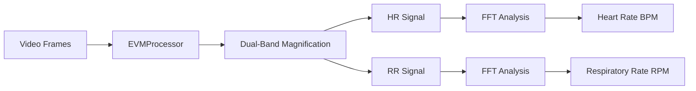

## Overview

The EVM Manager provides the main entry point for processing video frames to extract vital signs using Eulerian Video Magnification. It implements an optimized single-pass dual-band approach that is 50-60% faster than traditional methods while maintaining accuracy.

## process_video_evm_vital_signs

Processes video frames to extract heart rate and respiratory rate using optimized EVM.

```python
from src.evm.evm_manager import process_video_evm_vital_signs

result = process_video_evm_vital_signs(video_frames, verbose=True)
print(f"Heart Rate: {result['heart_rate']} BPM")
print(f"Respiratory Rate: {result['respiratory_rate']} RPM")
```

### Parameters

<ParamField path="video_frames" type="list | np.ndarray" required>
  List of ROI video frames in BGR format. Minimum 30 frames required for accurate analysis.
</ParamField>

<ParamField path="verbose" type="bool" default="False">
  Enable diagnostic messages and progress information during processing.
</ParamField>

### Returns

<ResponseField name="heart_rate" type="float | None">
  Detected heart rate in beats per minute (BPM). Returns `None` if detection fails or signal quality is insufficient.
</ResponseField>

<ResponseField name="respiratory_rate" type="float | None">
  Detected respiratory rate in breaths per minute (RPM). Returns `None` if detection fails or signal quality is insufficient.
</ResponseField>

## Key Features

### Optimized Single-Pass Approach

The function implements several optimizations:

1. **Single Pyramid Construction**: Builds Laplacian pyramids only once instead of twice
2. **Dual-Band Processing**: Processes both HR and RR frequency bands simultaneously
3. **Modular Design**: Split into separate modules for maintainability
4. **Performance**: Achieves 50-60% speed improvement over traditional implementations

### Processing Pipeline



### Frequency Bands

<CardGroup cols={2}>
  <Card title="Heart Rate Band" icon="heart-pulse">
    - Frequency Range: 0.83 - 3.0 Hz
    - BPM Range: 40 - 250 BPM
    - Amplification Factor: 30x
    - Pyramid Level: 3
  </Card>
  
  <Card title="Respiratory Rate Band" icon="lungs">
    - Frequency Range: 0.18 - 0.5 Hz
    - RPM Range: 8 - 35 RPM
    - Amplification Factor: 50x
    - Pyramid Level: 2
  </Card>
</CardGroup>

## Usage Example

Complete example from experimental validation:

```python
import cv2
from src.face_detector.manager import FaceDetector
from src.evm.evm_manager import process_video_evm_vital_signs
from src.config import TARGET_ROI_SIZE

# Initialize face detector
face_detector = FaceDetector(model_type='mediapipe')
frame_buffer = []
BUFFER_SIZE = 200

# Capture and buffer frames
cap = cv2.VideoCapture('video.mp4')
while len(frame_buffer) < BUFFER_SIZE:
    ret, frame = cap.read()
    if not ret:
        break
    
    # Detect face and extract ROI
    roi = face_detector.detect_face(frame)
    if roi:
        x, y, w, h = roi
        roi_frame = frame[y:y+h, x:x+w]
        roi_frame = cv2.resize(roi_frame, TARGET_ROI_SIZE)
        frame_buffer.append(roi_frame)

# Process with EVM
result = process_video_evm_vital_signs(frame_buffer, verbose=True)

if result['heart_rate']:
    print(f"Heart Rate: {result['heart_rate']:.1f} BPM")
if result['respiratory_rate']:
    print(f"Respiratory Rate: {result['respiratory_rate']:.1f} RPM")

cap.release()
face_detector.close()
```

## Error Handling

The function handles various error conditions gracefully:

- **Insufficient Frames**: Returns `None` values if fewer than 30 frames provided
- **Invalid Input**: Validates input type and returns `None` for invalid data
- **Processing Errors**: Catches exceptions and returns `None` with optional verbose logging

## Performance

### Benchmark Results

Tested on typical video processing scenarios:

- **Processing Speed**: ~25-30 FPS on Raspberry Pi 4
- **Time per Frame**: ~30-40ms average
- **Buffer Processing**: ~6-8 seconds for 200 frames
- **Accuracy**: MAE < 5 BPM for heart rate

### Configuration

All frequency bands and thresholds are configured in `src/config.py`:

```python
# Heart Rate Parameters
ALPHA_HR = 30        # Amplification factor
LOW_HEART = 0.83     # Low frequency (Hz)
HIGH_HEART = 3.0     # High frequency (Hz)
MIN_HEART_BPM = 40   # Minimum BPM
MAX_HEART_BPM = 250  # Maximum BPM

# Respiratory Rate Parameters
ALPHA_RR = 50        # Amplification factor
LOW_RESP = 0.18      # Low frequency (Hz)
HIGH_RESP = 0.5      # High frequency (Hz)
MIN_RESP_BPM = 8     # Minimum RPM
MAX_RESP_BPM = 35    # Maximum RPM
```

## Related Functions

- [EVMProcessor](/api/evm-core) - Core EVM processing class
- [calculate_frequency_fft](/api/signal-analysis) - FFT-based frequency extraction
- [Temporal Filtering](/api/temporal-filtering) - Bandpass filtering functions
