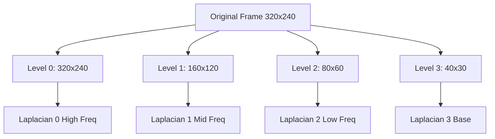

## Overview

Pyramid processing functions implement multi-scale decomposition of video frames using Gaussian and Laplacian pyramids. These pyramids enable EVM to operate at different spatial frequencies, essential for isolating different vital signs.

## build_gaussian_pyramid

Builds a Gaussian pyramid by iteratively downsampling the input frame.

```python
from src.evm.pyramid_processing import build_gaussian_pyramid

gaussian_pyr = build_gaussian_pyramid(frame, levels=3)
```

### Parameters

<ParamField path="frame" type="np.ndarray" required>
  Input frame in BGR format. Should be a valid numpy array representing an image.
</ParamField>

<ParamField path="levels" type="int" default="3">
  Number of pyramid levels to generate. Default from `config.LEVELS_RPI`.
  
  - Level 0: Original resolution
  - Level 1: 1/2 resolution
  - Level 2: 1/4 resolution
  - Level 3: 1/8 resolution
</ParamField>

### Returns

<ResponseField name="gaussian_pyramid" type="list[np.ndarray]">
  List of downsampled frames at different resolutions. Length is `levels + 1`.
</ResponseField>

## build_laplacian_pyramid

Builds a Laplacian pyramid from a Gaussian pyramid by computing differences between levels.

```python
from src.evm.pyramid_processing import build_laplacian_pyramid

laplacian_pyr = build_laplacian_pyramid(gaussian_pyramid)
```

### Parameters

<ParamField path="gaussian_pyramid" type="list[np.ndarray]" required>
  Pre-built Gaussian pyramid from `build_gaussian_pyramid`.
</ParamField>

### Returns

<ResponseField name="laplacian_pyramid" type="list[np.ndarray]">
  List of Laplacian pyramid levels. Each level contains high-frequency spatial details.
  Returns empty list if input is invalid.
</ResponseField>

### Algorithm

For each level `i` from 0 to `n-2`:

1. Expand (upsample) level `i+1` to match size of level `i`
2. Compute difference: `Laplacian[i] = Gaussian[i] - expanded`
3. The last level equals the last Gaussian level

```python
for i in range(len(gaussian_pyramid) - 1):
    size = (gaussian_pyramid[i].shape[1], gaussian_pyramid[i].shape[0])
    expanded = cv2.pyrUp(gaussian_pyramid[i + 1], dstsize=size)
    laplacian = cv2.subtract(gaussian_pyramid[i], expanded)
    laplacian_pyramid.append(laplacian)

laplacian_pyramid.append(gaussian_pyramid[-1])
```

## collapse_laplacian_pyramid

Reconstructs the original image from a Laplacian pyramid.

```python
from src.evm.pyramid_processing import collapse_laplacian_pyramid

reconstructed = collapse_laplacian_pyramid(laplacian_pyramid)
```

### Parameters

<ParamField path="laplacian_pyramid" type="list[np.ndarray]" required>
  Laplacian pyramid to reconstruct.
</ParamField>

### Returns

<ResponseField name="reconstructed" type="np.ndarray">
  Reconstructed image at original resolution. Returns empty array if pyramid is invalid.
</ResponseField>

### Algorithm

Iterates from the coarsest level to finest:

1. Start with the last (coarsest) level
2. For each level from `n-2` to 0:
   - Expand current result to match level size
   - Add Laplacian details: `result = expanded + Laplacian[i]`

```python
current = laplacian_pyramid[-1]
for i in range(len(laplacian_pyramid) - 2, -1, -1):
    size = (laplacian_pyramid[i].shape[1], laplacian_pyramid[i].shape[0])
    expanded = cv2.pyrUp(current, dstsize=size)
    current = cv2.add(expanded, laplacian_pyramid[i])
```

## build_video_pyramid_stack

Builds Laplacian pyramids for all frames in a video sequence.

```python
from src.evm.pyramid_processing import build_video_pyramid_stack

pyramid_stack = build_video_pyramid_stack(video_frames, levels=3)
```

### Parameters

<ParamField path="video_frames" type="list[np.ndarray]" required>
  List of video frames in BGR format.
</ParamField>

<ParamField path="levels" type="int" default="3">
  Number of pyramid levels to build for each frame.
</ParamField>

### Returns

<ResponseField name="laplacian_pyramids" type="list[list[np.ndarray]]">
  List of Laplacian pyramids, one per frame. Each pyramid is itself a list of pyramid levels.
  
  Structure: `pyramids[frame_idx][pyramid_level]`
</ResponseField>

### Usage Example

```python
video_frames = [...]  # 200 frames, each 320x240x3
pyramid_stack = build_video_pyramid_stack(video_frames, levels=3)

print(f"Number of frames: {len(pyramid_stack)}")  # 200
print(f"Levels per frame: {len(pyramid_stack[0])}")  # 4 (levels 0-3)

# Level 0: 320x240
# Level 1: 160x120
# Level 2: 80x60
# Level 3: 40x30
for level in range(4):
    shape = pyramid_stack[0][level].shape
    print(f"Level {level}: {shape[1]}x{shape[0]}")
```

## extract_pyramid_level

Extracts a specific pyramid level from all frames and normalizes dimensions.

```python
from src.evm.pyramid_processing import extract_pyramid_level

level_tensor = extract_pyramid_level(pyramid_stack, level=3)
```

### Parameters

<ParamField path="pyramid_stack" type="list[list[np.ndarray]]" required>
  Stack of Laplacian pyramids from `build_video_pyramid_stack`.
</ParamField>

<ParamField path="level" type="int" required>
  Pyramid level to extract (0 = finest, higher = coarser).
</ParamField>

### Returns

<ResponseField name="tensor" type="np.ndarray">
  4D tensor with shape `(T, H, W, C)` where:
  - `T` = number of frames
  - `H` = height at specified pyramid level
  - `W` = width at specified pyramid level  
  - `C` = number of color channels (3 for BGR)
  
  Returns empty array if extraction fails.
</ResponseField>

### Dimension Normalization

The function handles frames with inconsistent sizes:

1. Collects all frames at the specified level
2. Determines the most common shape
3. Resizes frames that don't match to the target shape
4. Returns a uniform tensor

```python
# Determine target shape (most common)
shapes = [frame.shape for frame in level_frames]
target_shape = max(unique_shapes.items(), key=lambda x: x[1])[0]

# Resize frames to match
for frame in level_frames:
    if frame.shape != target_shape:
        frame = cv2.resize(frame, (target_shape[1], target_shape[0]))
```

## Complete Pipeline Example

```python
import cv2
import numpy as np
from src.evm.pyramid_processing import (
    build_video_pyramid_stack,
    extract_pyramid_level
)

# Load video frames
video_frames = []
cap = cv2.VideoCapture('video.mp4')
for _ in range(200):
    ret, frame = cap.read()
    if ret:
        video_frames.append(frame)
cap.release()

# Build pyramids for all frames
print("Building pyramids...")
pyramid_stack = build_video_pyramid_stack(video_frames, levels=3)

# Extract different levels for different purposes
hr_tensor = extract_pyramid_level(pyramid_stack, level=3)  # For heart rate
rr_tensor = extract_pyramid_level(pyramid_stack, level=2)  # For respiration

print(f"HR tensor shape: {hr_tensor.shape}")  # (200, 40, 30, 3)
print(f"RR tensor shape: {rr_tensor.shape}")  # (200, 80, 60, 3)

# These tensors can now be temporally filtered
```

## Pyramid Visualization



## Spatial Frequency Decomposition

<CardGroup cols={4}>
  <Card title="Level 0" icon="grid">
    320x240
    
    Highest spatial frequency
    
    Fine details
  </Card>
  
  <Card title="Level 1" icon="grid-2">
    160x120
    
    High-mid frequency
    
    Medium details
  </Card>
  
  <Card title="Level 2" icon="grid-2-plus">
    80x60
    
    Mid-low frequency
    
    **Respiratory rate**
  </Card>
  
  <Card title="Level 3" icon="border-all">
    40x30
    
    Lowest frequency
    
    **Heart rate**
  </Card>
</CardGroup>

## Error Handling

All functions include comprehensive error handling:

- **Invalid Input**: Returns empty structures for None or invalid inputs
- **Pyramid Building Failures**: Returns single-level pyramids containing original frame
- **Dimension Mismatches**: Automatically resizes to most common shape
- **Exception Logging**: Prints diagnostic messages for debugging

## Performance Considerations

### Memory Usage

Pyramids use additional memory:

- Original frame: 320x240x3 = 230KB (float32)
- Level 1: 160x120x3 = 58KB
- Level 2: 80x60x3 = 14KB  
- Level 3: 40x30x3 = 3.6KB
- **Total per frame**: ~305KB
- **For 200 frames**: ~61MB

### Processing Time

Benchmark on Raspberry Pi 4:

- **Gaussian pyramid**: ~5-8ms per frame
- **Laplacian pyramid**: ~3-5ms per frame
- **Total stack (200 frames)**: ~1.5-2.5 seconds

## Related Functions

- [EVMProcessor.process_dual_band](/api/evm-core) - Uses pyramid processing
- [apply_temporal_bandpass](/api/temporal-filtering) - Filters pyramid tensors
