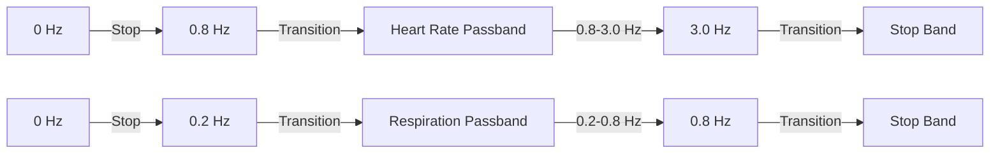

## Overview

Temporal filtering functions apply bandpass filters along the temporal dimension of video tensors to isolate specific frequency bands corresponding to vital signs. The implementation uses Butterworth filters for smooth frequency response.

## create_bandpass_filter

Creates Butterworth bandpass filter coefficients for a specified frequency range.

```python
from src.evm.temporal_filtering import create_bandpass_filter

nyquist = fps / 2.0
b, a = create_bandpass_filter(lowcut=0.8, highcut=3.0, nyquist=nyquist, order=2)
```

### Parameters

<ParamField path="lowcut" type="float" required>
  Low cutoff frequency in Hz. Frequencies below this are attenuated.
</ParamField>

<ParamField path="highcut" type="float" required>
  High cutoff frequency in Hz. Frequencies above this are attenuated.
</ParamField>

<ParamField path="nyquist" type="float" required>
  Nyquist frequency (sampling_rate / 2). For 30 FPS video, nyquist = 15 Hz.
</ParamField>

<ParamField path="order" type="int" default="2">
  Filter order. Higher order = steeper roll-off but more computational cost.
  
  - Order 2: Good balance for real-time processing
  - Order 4: Better frequency separation
</ParamField>

### Returns

<ResponseField name="b" type="np.ndarray">
  Numerator coefficients of the IIR filter.
</ResponseField>

<ResponseField name="a" type="np.ndarray">
  Denominator coefficients of the IIR filter.
</ResponseField>

<ResponseField name="None" type="None">
  Returns `None` if filter creation fails (e.g., invalid frequency range).
</ResponseField>

### Implementation Details

The function normalizes frequencies and applies safety bounds:

```python
# Normalize to [0, 1] range relative to Nyquist
low_norm = max(0.01, min(lowcut / nyquist, 0.99))
high_norm = max(0.01, min(highcut / nyquist, 0.99))

# Create Butterworth bandpass filter
if low_norm < high_norm:
    b, a = butter(order, [low_norm, high_norm], btype='band')
    return b, a
```

## apply_temporal_bandpass

Applies temporal bandpass filter to a video tensor along the time axis.

```python
from src.evm.temporal_filtering import apply_temporal_bandpass

filtered_tensor = apply_temporal_bandpass(
    tensor=video_tensor,
    lowcut=0.8,
    highcut=3.0,
    fps=30,
    axis=0
)
```

### Parameters

<ParamField path="tensor" type="np.ndarray" required>
  Video tensor with shape `(T, H, W, C)` where T is the temporal dimension.
</ParamField>

<ParamField path="lowcut" type="float" required>
  Low cutoff frequency in Hz.
</ParamField>

<ParamField path="highcut" type="float" required>
  High cutoff frequency in Hz.
</ParamField>

<ParamField path="fps" type="float" required>
  Frames per second of the video (sampling rate).
</ParamField>

<ParamField path="axis" type="int" default="0">
  Axis along which to apply the filter (0 = temporal axis).
</ParamField>

### Returns

<ResponseField name="filtered_tensor" type="np.ndarray">
  Temporally filtered tensor with same shape as input. Returns original tensor if filtering fails.
</ResponseField>

### Zero-Phase Filtering

Uses `scipy.signal.filtfilt` for zero-phase filtering:

```python
filtered = filtfilt(b, a, tensor, axis=axis)
```

**Benefits of filtfilt**:
- Zero phase distortion
- No time delay introduced
- Forward-backward filtering for stability

## temporal_dual_bandpass_filter

Applies two bandpass filters simultaneously to extract both HR and RR signals efficiently.

```python
from src.evm.temporal_filtering import temporal_dual_bandpass_filter

filtered_hr, filtered_rr = temporal_dual_bandpass_filter(
    video_tensor=tensor,
    fps=30,
    low_heart=0.8,
    high_heart=3.0,
    low_resp=0.2,
    high_resp=0.8,
    axis=0
)
```

### Parameters

<ParamField path="video_tensor" type="np.ndarray" required>
  Video tensor with shape `(T, H, W, C)`.
</ParamField>

<ParamField path="fps" type="float" required>
  Frames per second of the video.
</ParamField>

<ParamField path="low_heart" type="float" required>
  Heart rate low frequency bound (Hz). Default: 0.83 Hz (50 BPM).
</ParamField>

<ParamField path="high_heart" type="float" required>
  Heart rate high frequency bound (Hz). Default: 3.0 Hz (180 BPM).
</ParamField>

<ParamField path="low_resp" type="float" required>
  Respiratory rate low frequency bound (Hz). Default: 0.18 Hz (11 RPM).
</ParamField>

<ParamField path="high_resp" type="float" required>
  Respiratory rate high frequency bound (Hz). Default: 0.5 Hz (30 RPM).
</ParamField>

<ParamField path="axis" type="int" default="0">
  Temporal axis for filtering.
</ParamField>

### Returns

<ResponseField name="filtered_hr_tensor" type="np.ndarray">
  Tensor filtered for heart rate frequency band (0.8-3 Hz).
</ResponseField>

<ResponseField name="filtered_rr_tensor" type="np.ndarray">
  Tensor filtered for respiratory rate frequency band (0.2-0.8 Hz).
</ResponseField>

## Frequency Band Configuration

### Heart Rate Band

Optimized for detecting cardiac pulse:

```python
LOW_HEART = 0.83    # 50 BPM
HIGH_HEART = 3.0    # 180 BPM
```

<Info>
  The HR band (0.83-3.0 Hz) corresponds to 50-180 beats per minute, covering resting to exercise heart rates.
</Info>

### Respiratory Rate Band

Optimized for detecting breathing:

```python
LOW_RESP = 0.18     # 11 RPM
HIGH_RESP = 0.5     # 30 RPM
```

<Info>
  The RR band (0.18-0.5 Hz) corresponds to 11-30 breaths per minute, covering normal breathing rates.
</Info>

## Usage Example: EVM Processing

Complete example showing temporal filtering in the EVM pipeline:

```python
import numpy as np
from src.evm.pyramid_processing import build_video_pyramid_stack, extract_pyramid_level
from src.evm.temporal_filtering import apply_temporal_bandpass
from src.config import FPS, LOW_HEART, HIGH_HEART, LOW_RESP, HIGH_RESP

# Build pyramids
video_frames = [...]  # 200 BGR frames
pyramid_stack = build_video_pyramid_stack(video_frames, levels=3)

# Extract levels
hr_tensor = extract_pyramid_level(pyramid_stack, level=3)
rr_tensor = extract_pyramid_level(pyramid_stack, level=2)

print(f"HR tensor shape: {hr_tensor.shape}")  # (200, 40, 30, 3)
print(f"RR tensor shape: {rr_tensor.shape}")  # (200, 80, 60, 3)

# Apply temporal filtering
hr_filtered = apply_temporal_bandpass(
    tensor=hr_tensor,
    lowcut=LOW_HEART,    # 0.83 Hz
    highcut=HIGH_HEART,  # 3.0 Hz
    fps=FPS,             # 30
    axis=0
)

rr_filtered = apply_temporal_bandpass(
    tensor=rr_tensor,
    lowcut=LOW_RESP,     # 0.18 Hz
    highcut=HIGH_RESP,   # 0.5 Hz
    fps=FPS,
    axis=0
)

print(f"Filtered HR tensor range: {hr_filtered.min():.2f} to {hr_filtered.max():.2f}")
print(f"Filtered RR tensor range: {rr_filtered.min():.2f} to {rr_filtered.max():.2f}")

# Now amplify and extract signals
hr_filtered *= 30  # Amplification
rr_filtered *= 50
```

## Filter Response Characteristics

### Butterworth Filter Properties

<CardGroup cols={2}>
  <Card title="Frequency Response" icon="wave-square">
    - Maximally flat passband
    - Smooth roll-off
    - No ripple in passband
  </Card>
  
  <Card title="Phase Response" icon="timeline">
    - Zero phase (using filtfilt)
    - No time delay
    - Preserves waveform shape
  </Card>
</CardGroup>

### Order 2 vs Order 4

| Property | Order 2 | Order 4 |
|----------|---------|----------|
| Roll-off | -40 dB/decade | -80 dB/decade |
| Computation | Faster | Slower |
| Frequency separation | Good | Excellent |
| Use case | Real-time | Offline analysis |

## Frequency Response Visualization



## Performance Considerations

### Computational Cost

For a typical tensor `(200, 40, 30, 3)` on Raspberry Pi 4:

- **Filter creation**: < 1ms
- **filtfilt application**: ~50-100ms per tensor
- **Total for dual-band**: ~100-200ms

### Memory Usage

Filtering is done in-place where possible:

- **Input tensor**: 200×40×30×3×4 bytes = 2.88 MB
- **Output tensor**: 2.88 MB (same)
- **Temporary arrays**: ~3-5 MB during filtfilt
- **Peak usage**: ~8-10 MB

## Edge Effects

To minimize edge artifacts:

1. **Minimum frames**: Requires at least 10 frames (enforced in code)
2. **filtfilt padding**: Automatically pads signal to reduce edge effects
3. **Buffer size**: Use 200+ frames for best results

```python
if len(tensor) < 10:
    return tensor  # Skip filtering for very short sequences
```

## Error Handling

Robust error handling prevents crashes:

- **Invalid frequency range**: Returns `None` filter coefficients
- **Filtering failure**: Returns original tensor unmodified
- **Short sequences**: Skips filtering for tensors with < 10 frames
- **Exception logging**: Prints diagnostic messages

## Related Functions

- [EVMProcessor.process_dual_band](/api/evm-core) - Uses temporal filtering
- [extract_pyramid_level](/api/pyramid-processing) - Provides tensors to filter
- [calculate_frequency_fft](/api/signal-analysis) - Analyzes filtered signals
