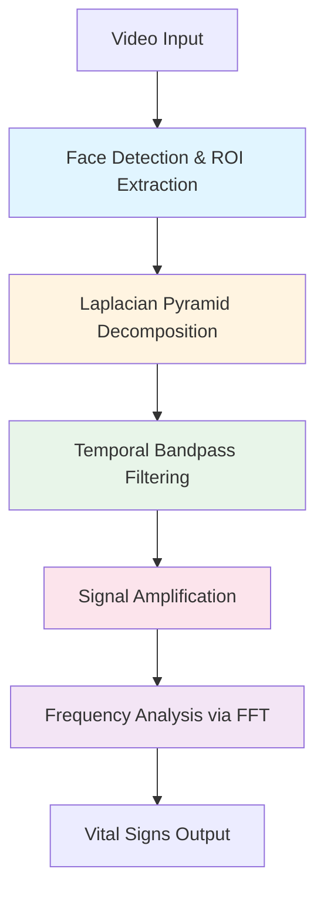

## Introduction

The EVM Vital Signs Monitor is a contactless vital signs monitoring system that uses **Eulerian Video Magnification (EVM)** to extract heart rate (HR) and respiratory rate (RR) from standard video input. The system processes video in real-time, detecting subtle color changes in the face region that correspond to physiological signals.

<Info>
  The system achieves **50-60% faster performance** than traditional dual-pass EVM implementations through a single-pass dual-band processing optimization.
</Info>

## System Workflow

The complete processing pipeline consists of five main stages:



### Processing Stages

<AccordionGroup>
  <Accordion title="Stage 1: Face Detection & ROI Extraction" icon="face-smile">
    The system first detects faces in the video stream and extracts a stable Region of Interest (ROI):
    
    - **Multiple detector backends**: Haar Cascade, MTCNN, YOLO, MediaPipe
    - **Temporal stabilization**: Weighted averaging over last 5 frames reduces jitter
    - **ROI weights**: `[0.1, 0.15, 0.2, 0.25, 0.3]` (recent frames weighted higher)
    - **Adaptive boundaries**: Ensures ROI stays within frame limits
    
    **Source**: `src/face_detector/manager.py:95-130`
  </Accordion>

  <Accordion title="Stage 2: Pyramid Decomposition" icon="layer-group">
    Each ROI frame is decomposed into a Laplacian pyramid for multi-resolution analysis:
    
    - **Gaussian pyramid**: Successive downsampling creates multiple resolution levels
    - **Laplacian pyramid**: Difference between Gaussian levels captures spatial frequencies
    - **Default levels**: 3 levels optimized for Raspberry Pi performance
    - **Dual-band optimization**: Single pyramid construction supports both HR and RR extraction
    
    Different pyramid levels capture different spatial frequencies:
    - **Level 3**: Higher spatial frequency (optimal for heart rate)
    - **Level 2**: Lower spatial frequency (optimal for respiration)
    
    **Source**: `src/evm/pyramid_processing.py:98-126`
  </Accordion>

  <Accordion title="Stage 3: Temporal Filtering" icon="filter">
    Separate bandpass filters isolate physiological frequency bands:
    
    **Heart Rate Band (0.8-3 Hz)**:
    - Frequency range: 48-180 BPM
    - Applied to pyramid level 3
    - Butterworth bandpass filter (order 2)
    
    **Respiratory Rate Band (0.2-0.8 Hz)**:
    - Frequency range: 12-48 breaths per minute
    - Applied to pyramid level 2
    - Independent filtering allows simultaneous extraction
    
    **Source**: `src/evm/temporal_filtering.py:30-60`
  </Accordion>

  <Accordion title="Stage 4: Signal Amplification" icon="arrow-up">
    Filtered signals are amplified to enhance subtle variations:
    
    - **Heart rate amplification**: α = 30
    - **Respiratory rate amplification**: α = 50
    - **Spatial averaging**: Green channel for HR, all channels for RR
    
    The amplification factors are carefully tuned to maximize signal visibility while avoiding motion artifacts.
    
    **Source**: `src/evm/evm_core.py:98-108`
  </Accordion>

  <Accordion title="Stage 5: Frequency Analysis" icon="wave-square">
    FFT-based spectral analysis extracts dominant frequencies:
    
    1. **Signal preprocessing**: Detrending and normalization
    2. **Hamming window**: Reduces spectral leakage
    3. **FFT computation**: Converts to frequency domain
    4. **Peak detection**: Finds dominant frequency in physiological range
    5. **Validation**: Ensures result falls within plausible bounds
    
    **Source**: `src/evm/signal_analysis.py:127-158`
  </Accordion>
</AccordionGroup>

## Key Architectural Components

### Core Modules

| Module | Location | Responsibility |
|--------|----------|----------------|
| **EVMProcessor** | `src/evm/evm_core.py` | Orchestrates dual-band EVM processing |
| **FaceDetector** | `src/face_detector/manager.py` | Manages face detection and ROI stabilization |
| **Pyramid Processing** | `src/evm/pyramid_processing.py` | Builds and manipulates Laplacian pyramids |
| **Temporal Filtering** | `src/evm/temporal_filtering.py` | Applies bandpass filters to isolate frequencies |
| **Signal Analysis** | `src/evm/signal_analysis.py` | FFT-based frequency extraction |
| **Configuration** | `src/config.py` | Central parameter definitions |

### Data Flow

<Steps>
  <Step title="Video Frame Acquisition">
    Input frames are captured at 30 FPS (configurable) and resized to 320x240 for processing efficiency.
  </Step>
  
  <Step title="ROI Extraction">
    Face detector identifies face region and applies temporal smoothing to maintain stable ROI across frames.
  </Step>
  
  <Step title="Single-Pass Pyramid Construction">
    One Laplacian pyramid stack is built for the entire video buffer (typically 30+ frames).
  </Step>
  
  <Step title="Dual-Band Processing">
    Two pyramid levels are extracted and filtered independently:
    - Level 3 tensor → HR bandpass → α=30 amplification → Green channel signal
    - Level 2 tensor → RR bandpass → α=50 amplification → All-channel signal
  </Step>
  
  <Step title="Frequency Extraction">
    Both signals undergo FFT analysis to extract dominant frequencies within physiological ranges.
  </Step>
</Steps>

## Performance Optimization

<Note>
  **Key Innovation**: The dual-band processing approach builds Laplacian pyramids only once, then applies different temporal filters to different pyramid levels. This eliminates the need for separate pyramid construction for HR and RR, achieving 50-60% performance improvement.
</Note>

### Traditional vs. Optimized Approach

**Traditional (Two-Pass)**:
```python
# First pass: Heart rate
pyramids_hr = build_pyramids(frames)
filtered_hr = bandpass(pyramids_hr, 0.8, 3.0)
hr_result = analyze(filtered_hr)

# Second pass: Respiratory rate (rebuilds pyramids!)
pyramids_rr = build_pyramids(frames)
filtered_rr = bandpass(pyramids_rr, 0.2, 0.8)
rr_result = analyze(filtered_rr)
```

**Optimized (Single-Pass)**:
```python
# Single pyramid construction
pyramids = build_pyramids(frames)

# Extract different levels
tensor_hr = extract_level(pyramids, level=3)
tensor_rr = extract_level(pyramids, level=2)

# Parallel filtering and analysis
hr_result = analyze(bandpass(tensor_hr, 0.8, 3.0))
rr_result = analyze(bandpass(tensor_rr, 0.2, 0.8))
```

**Reference**: `src/evm/evm_core.py:40-109`

## Configuration Parameters

Key system parameters are defined in `src/config.py:1-33`:

```python
# Heart Rate Parameters
ALPHA_HR = 30          # Amplification factor
LOW_HEART = 0.83       # Low cutoff (Hz)
HIGH_HEART = 3.0       # High cutoff (Hz)
MIN_HEART_BPM = 40     # Validation range
MAX_HEART_BPM = 250

# Respiratory Rate Parameters
ALPHA_RR = 50          # Amplification factor
LOW_RESP = 0.18        # Low cutoff (Hz)
HIGH_RESP = 0.5        # High cutoff (Hz)
MIN_RESP_BPM = 8       # Validation range
MAX_RESP_BPM = 35

# Processing Parameters
FPS = 30               # Frame rate
LEVELS_RPI = 3         # Pyramid levels
TARGET_ROI_SIZE = (320, 240)  # ROI dimensions
```

## Next Steps

<CardGroup cols={2}>
  <Card title="Eulerian Video Magnification" icon="video" href="/concepts/eulerian-video-magnification">
    Deep dive into the EVM technique and dual-band implementation
  </Card>
  
  <Card title="Signal Processing" icon="wave-square" href="/concepts/signal-processing">
    Learn about temporal filtering and FFT-based frequency analysis
  </Card>
  
  <Card title="Face Detection" icon="face-smile" href="/concepts/face-detection">
    Explore ROI extraction and stabilization techniques
  </Card>
  
  <Card title="API Reference" icon="code" href="/api-reference/introduction">
    Browse the complete API documentation
  </Card>
</CardGroup>
