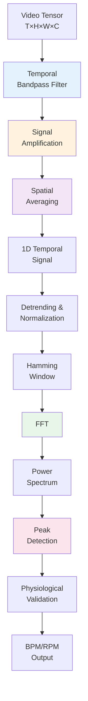

## Overview

The signal processing pipeline transforms magnified video signals into accurate vital sign measurements. This involves temporal bandpass filtering to isolate physiological frequencies, followed by FFT-based spectral analysis to extract dominant frequencies.

<Info>
  The pipeline uses scientifically validated techniques from digital signal processing, including Butterworth filters and Fast Fourier Transform (FFT) with Hamming windowing.
</Info>

## Temporal Bandpass Filtering

Temporal filtering isolates the frequency components that correspond to heart rate and respiratory rate by removing DC components, low-frequency drift, and high-frequency noise.

### Filter Design

The system uses **Butterworth bandpass filters** for their maximally flat frequency response in the passband:

```python
def create_bandpass_filter(lowcut, highcut, nyquist, order=2):
    """
    Create Butterworth bandpass filter.
    
    Args:
        lowcut: Low cutoff frequency (Hz)
        highcut: High cutoff frequency (Hz)
        nyquist: Nyquist frequency (FPS/2)
        order: Filter order (default=2)
    
    Returns:
        tuple: (b, a) filter coefficients or None if fails
    """
    # Normalize frequencies to [0, 1] range
    low_norm = max(0.01, min(lowcut / nyquist, 0.99))
    high_norm = max(0.01, min(highcut / nyquist, 0.99))
    
    if low_norm < high_norm:
        b, a = butter(order, [low_norm, high_norm], btype='band')
        return b, a
    else:
        return None
```

**Source**: `src/evm/temporal_filtering.py:3-27`

<Accordion title="Why Butterworth Filters?">
  **Advantages**:
  - Maximally flat passband (no ripples)
  - Predictable roll-off characteristics
  - Stable for low-order implementations
  - Computationally efficient
  
  **Alternatives considered**:
  - Chebyshev (steeper roll-off but passband ripples)
  - Bessel (better phase response but slower roll-off)
  - Elliptic (sharpest cutoff but both passband and stopband ripples)
</Accordion>

### Filter Application

The `apply_temporal_bandpass()` function applies the filter along the temporal axis of the video tensor:

```python
def apply_temporal_bandpass(tensor, lowcut, highcut, fps, axis=0):
    """
    Apply temporal bandpass filter to video tensor.
    
    Args:
        tensor: Video tensor (T x H x W x C)
        lowcut: Low cutoff frequency (Hz)
        highcut: High cutoff frequency (Hz)
        fps: Frames per second
        axis: Temporal axis (default=0)
    
    Returns:
        np.ndarray: Filtered tensor
    """
    if len(tensor) < 10:
        return tensor  # Insufficient data for filtering
    
    nyquist = fps / 2.0
    filter_coeffs = create_bandpass_filter(lowcut, highcut, nyquist)
    
    if filter_coeffs is None:
        return tensor
    
    b, a = filter_coeffs
    
    try:
        # Zero-phase filtering (forward-backward)
        filtered = filtfilt(b, a, tensor, axis=axis)
        return filtered
    except Exception as e:
        print(f"[FILTER] Error applying filter: {e}")
        return tensor
```

**Source**: `src/evm/temporal_filtering.py:30-60`

<Note>
  The `filtfilt()` function applies the filter twice (forward and backward) to achieve zero-phase distortion, which is critical for preserving temporal alignment of physiological signals.
</Note>

### Frequency Bands

<CardGroup cols={2}>
  <Card title="Heart Rate Band" icon="heart-pulse">
    **Frequency Range**: 0.8 - 3.0 Hz
    
    **BPM Equivalent**: 48 - 180 BPM
    
    **Configuration**:
    ```python
    LOW_HEART = 0.83   # Hz
    HIGH_HEART = 3.0   # Hz
    ```
    
    Captures cardiac pulse variations visible through photoplethysmography.
  </Card>
  
  <Card title="Respiratory Rate Band" icon="lungs">
    **Frequency Range**: 0.2 - 0.8 Hz
    
    **BPM Equivalent**: 12 - 48 breaths/min
    
    **Configuration**:
    ```python
    LOW_RESP = 0.18    # Hz
    HIGH_RESP = 0.5    # Hz
    ```
    
    Captures breathing-related motion and color changes.
  </Card>
</CardGroup>

**Source**: `src/config.py:3-14`

### Dual-Band Filtering

While both bands can be filtered in a single function call, the system processes them independently for maximum flexibility:

```python
def temporal_dual_bandpass_filter(video_tensor, fps, 
                                  low_heart, high_heart,
                                  low_resp, high_resp, axis=0):
    """
    Apply TWO bandpass filters simultaneously to video tensor.
    More efficient than filtering twice separately.
    """
    if len(video_tensor) < 10:
        return video_tensor, video_tensor
    
    # Heart rate filtering
    filtered_hr = apply_temporal_bandpass(
        video_tensor, low_heart, high_heart, fps, axis
    )
    
    # Respiration rate filtering
    filtered_rr = apply_temporal_bandpass(
        video_tensor, low_resp, high_resp, fps, axis
    )
    
    return filtered_hr, filtered_rr
```

**Source**: `src/evm/temporal_filtering.py:63-95`

## Signal Extraction

After filtering and amplification, spatial averaging converts the 4D tensor (Time × Height × Width × Channels) into a 1D temporal signal.

### Spatial Averaging

```python
def extract_temporal_signal(video_tensor, use_green_channel=True):
    """
    Extract temporal signal by spatially averaging each frame.
    
    Args:
        video_tensor: Frame tensor (T x H x W x C)
        use_green_channel: If True, use only green channel (better for HR)
    
    Returns:
        np.ndarray: 1D temporal signal
    """
    signal = []
    
    for frame in video_tensor:
        if use_green_channel and frame.ndim == 3:
            mean_val = np.mean(frame[:, :, 1])  # Green channel (index 1 in BGR)
        else:
            mean_val = np.mean(frame)
        signal.append(mean_val)
    
    return np.array(signal)
```

**Source**: `src/evm/signal_analysis.py:4-23`

<Accordion title="Why Green Channel for Heart Rate?">
  The green channel (wavelength ~550 nm) provides the best signal-to-noise ratio for photoplethysmography:
  
  - **Maximum hemoglobin absorption**: Green light is strongly absorbed by hemoglobin
  - **Reduced motion artifacts**: Less sensitive to skin tone variations
  - **Better penetration**: Optimal depth for capillary bed imaging
  
  Research shows green channel SNR is typically 2-3× better than red or blue channels for cardiac signals.
</Accordion>

## Frequency Analysis via FFT

Fast Fourier Transform (FFT) converts the temporal signal from time domain to frequency domain, allowing identification of dominant periodicities.

### Signal Preprocessing

Before FFT, the signal undergoes preprocessing to improve spectral quality:

```python
def preprocess_signal(signal):
    """
    Preprocess signal: detrending and normalization.
    
    Returns:
        np.ndarray: Preprocessed signal or None if fails
    """
    if signal is None or len(signal) < 20:
        return None
    
    # Check if signal is constant
    if np.std(signal) < 1e-10:
        return None
    
    # 1. Detrending (remove linear trend)
    signal_detrended = sp_signal.detrend(signal)
    
    # 2. Check if detrended signal is constant
    signal_std = np.std(signal_detrended)
    if signal_std < 1e-8:
        return None
    
    # 3. Normalization
    signal_normalized = signal_detrended / signal_std
    
    return signal_normalized
```

**Source**: `src/evm/signal_analysis.py:25-55`

<Steps>
  <Step title="Validation">
    Ensure signal has sufficient length (≥20 samples) and non-zero variance.
  </Step>
  
  <Step title="Detrending">
    Remove linear trend to eliminate low-frequency drift and DC offset.
  </Step>
  
  <Step title="Normalization">
    Scale signal to unit standard deviation for consistent spectral analysis.
  </Step>
</Steps>

### Hamming Window

A Hamming window reduces spectral leakage by smoothly tapering the signal at boundaries:

```python
def apply_hamming_window(signal):
    """
    Apply Hamming window to signal.
    """
    window = np.hamming(len(signal))
    return signal * window
```

**Source**: `src/evm/signal_analysis.py:57-67`

<Accordion title="Spectral Leakage Explained">
  **The Problem**:
  - FFT assumes the signal is periodic over the window length
  - Real signals rarely satisfy this assumption
  - Discontinuities at window boundaries create spurious frequencies
  
  **The Solution**:
  - Hamming window gradually reduces signal amplitude toward edges
  - Window formula: w(n) = 0.54 - 0.46 × cos(2πn/N)
  - Reduces side lobe levels by ~40 dB
  
  **Trade-off**:
  - Reduces spectral leakage
  - Slightly broadens the main lobe (reduces frequency resolution)
  - For vital signs, this trade-off is favorable
</Accordion>

### Power Spectrum Calculation

```python
def calculate_power_spectrum(signal, fps):
    """
    Calculate power spectrum using FFT.
    
    Returns:
        tuple: (frequencies, power_spectrum)
    """
    # FFT
    fft_vals = np.fft.fft(signal)
    fft_freq = np.fft.fftfreq(len(signal), d=1.0/fps)
    
    # Power spectrum
    power_spectrum = np.abs(fft_vals) ** 2
    
    return fft_freq, power_spectrum
```

**Source**: `src/evm/signal_analysis.py:69-86`

The power spectrum represents the distribution of signal energy across frequencies. Peaks in the power spectrum indicate dominant periodicities.

### Dominant Frequency Detection

```python
def find_dominant_frequency(fft_freq, power_spectrum, lowcut_hz, highcut_hz, 
                           min_bpm, max_bpm):
    """
    Find dominant frequency within specific range.
    
    Returns:
        float: Frequency in BPM or None
    """
    # Physiological range mask
    freq_mask = (fft_freq >= lowcut_hz) & (fft_freq <= highcut_hz)
    
    if not np.any(freq_mask):
        return None
    
    # Dominant peak
    masked_power = power_spectrum[freq_mask]
    masked_freqs = fft_freq[freq_mask]
    
    if len(masked_power) == 0:
        return None
    
    # Find peak frequency
    dominant_freq_hz = masked_freqs[np.argmax(masked_power)]
    
    # Convert to BPM/RPM
    frequency_bpm = abs(dominant_freq_hz * 60.0)
    
    # Validation against physiological limits
    if frequency_bpm < min_bpm or frequency_bpm > max_bpm:
        return None
    
    return frequency_bpm
```

**Source**: `src/evm/signal_analysis.py:88-125`

<Warning>
  The function includes physiological validation to reject unrealistic values:
  - Heart rate: 40-250 BPM
  - Respiratory rate: 8-35 breaths/min
  
  This prevents false detections from noise or artifacts.
</Warning>

### Complete Pipeline

The `calculate_frequency_fft()` function orchestrates the complete analysis:

```python
def calculate_frequency_fft(temporal_signal, fps, lowcut_hz, highcut_hz, 
                           min_bpm, max_bpm):
    """
    Complete pipeline: calculate dominant frequency using FFT.
    
    Returns:
        float: Frequency in BPM or None if fails
    """
    # Preprocessing
    signal_processed = preprocess_signal(temporal_signal)
    if signal_processed is None:
        return None
    
    # Hamming window
    signal_windowed = apply_hamming_window(signal_processed)
    
    # FFT
    fft_freq, power_spectrum = calculate_power_spectrum(signal_windowed, fps)
    
    # Dominant frequency
    frequency_bpm = find_dominant_frequency(
        fft_freq, power_spectrum, lowcut_hz, highcut_hz, min_bpm, max_bpm
    )
    
    return frequency_bpm
```

**Source**: `src/evm/signal_analysis.py:127-158`

## Processing Flow Diagram



## Validation and Quality Control

### Physiological Bounds

The system enforces strict physiological limits configured in `src/config.py:6-14`:

```python
# Heart Rate Bounds
MAX_HEART_BPM = 250  # Maximum plausible HR
MIN_HEART_BPM = 40   # Minimum plausible HR

# Respiratory Rate Bounds
MAX_RESP_BPM = 35    # Maximum plausible RR
MIN_RESP_BPM = 8     # Minimum plausible RR
```

### Signal Quality Checks

<AccordionGroup>
  <Accordion title="Minimum Frame Count">
    Requires ≥30 frames for reliable frequency analysis:
    
    ```python
    if len(video_frames) < 30:
        return None, None
    ```
    
    **Reason**: At 30 FPS, 30 frames = 1 second of data. Reliable spectral analysis requires multiple cycles of the target frequency.
  </Accordion>
  
  <Accordion title="Non-Zero Variance">
    Rejects constant or near-constant signals:
    
    ```python
    if np.std(signal) < 1e-10:
        return None
    ```
    
    **Reason**: Constant signals indicate ROI failure, static images, or sensor issues.
  </Accordion>
  
  <Accordion title="Valid Frequency Range">
    Ensures detected frequency falls within physiological and filter passband:
    
    ```python
    if frequency_bpm < min_bpm or frequency_bpm > max_bpm:
        return None
    ```
    
    **Reason**: Prevents reporting noise peaks as valid measurements.
  </Accordion>
</AccordionGroup>

## Performance Considerations

### Computational Complexity

| Operation | Complexity | Notes |
|-----------|-----------|-------|
| Butterworth filter design | O(1) | Constant time for fixed order |
| filtfilt() application | O(N × M) | N frames, M pixels per frame |
| Spatial averaging | O(N × M) | Single pass through tensor |
| FFT | O(N log N) | N = signal length |
| Peak detection | O(N) | Linear scan of power spectrum |

<Note>
  Total complexity is dominated by filtering: O(N × M). For typical parameters (30 frames, 40×30 pixels at level 3), this is ~36,000 operations per band.
</Note>

### Optimization Strategies

1. **Pyramid-level processing**: Operate on downsampled data
2. **Green channel extraction**: Process 1 channel instead of 3
3. **Single-pass filtering**: Process both bands from same pyramid
4. **Vectorized operations**: NumPy/SciPy use optimized BLAS/LAPACK

## Usage Example

```python
from src.evm.signal_analysis import calculate_frequency_fft
from src.config import FPS, LOW_HEART, HIGH_HEART, MIN_HEART_BPM, MAX_HEART_BPM

# After obtaining temporal signal from EVM
heart_rate = calculate_frequency_fft(
    temporal_signal=signal_hr,
    fps=FPS,
    lowcut_hz=LOW_HEART,
    highcut_hz=HIGH_HEART,
    min_bpm=MIN_HEART_BPM,
    max_bpm=MAX_HEART_BPM
)

if heart_rate:
    print(f"Detected heart rate: {heart_rate:.1f} BPM")
else:
    print("Heart rate detection failed")
```

## Related Concepts

<CardGroup cols={2}>
  <Card title="Eulerian Video Magnification" icon="video" href="/concepts/eulerian-video-magnification">
    Learn about pyramid decomposition and amplification
  </Card>
  
  <Card title="Face Detection" icon="face-smile" href="/concepts/face-detection">
    Understand ROI extraction for signal processing
  </Card>
  
  <Card title="System Overview" icon="diagram-project" href="/concepts/overview">
    See how signal processing fits in the pipeline
  </Card>
  
  <Card title="API Reference" icon="code" href="/api-reference/signal/analysis">
    Explore signal analysis API
  </Card>
</CardGroup>
