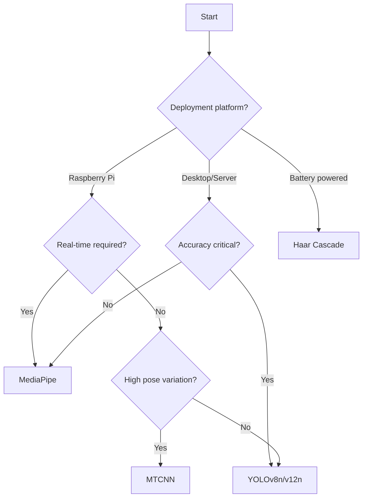

## Overview

The EVM Vital Signs Monitor supports four face detection models, each with different trade-offs between accuracy, speed, and resource requirements. This guide helps you choose the right detector for your use case.

## Available Detectors

<CardGroup cols={2}>
  <Card title="MediaPipe" icon="bolt">
    Fast and accurate - **recommended for Raspberry Pi**
  </Card>
  <Card title="YOLOv8/v12" icon="crosshairs">
    Highest accuracy - best for challenging conditions
  </Card>
  <Card title="Haar Cascade" icon="gauge-simple">
    Lightweight - minimal resource usage
  </Card>
  <Card title="MTCNN" icon="diamond">
    Robust to pose variations
  </Card>
</CardGroup>

---

## Performance Comparison

Performance metrics measured on **Raspberry Pi 4** (4GB RAM):

| Detector | FPS | Accuracy | Memory | CPU Usage | Recommended Use |
|----------|-----|----------|--------|-----------|----------------|
| **MediaPipe** | 30-40 | High | 150 MB | 40-50% | Real-time, embedded |
| **YOLOv8n** | 15-25 | Very High | 300 MB | 70-80% | Challenging lighting |
| **YOLOv12n** | 12-20 | Very High | 320 MB | 75-85% | Maximum accuracy |
| **Haar Cascade** | 45-60 | Medium | 50 MB | 20-30% | Low-power devices |
| **MTCNN** | 8-15 | High | 400 MB | 80-90% | Offline processing |

<Note>
  FPS measurements are for detection only. End-to-end system performance (including EVM) is ~3-4 seconds per measurement regardless of detector.
</Note>

---

## Detailed Comparison

### MediaPipe Face Detection

**Best for:** Real-time applications, Raspberry Pi deployment, production use

<Tabs>
  <Tab title="Overview">
    Google's MediaPipe provides a lightweight neural network optimized for mobile and edge devices.
    
    **Strengths:**
    - Excellent speed-accuracy balance
    - Low memory footprint
    - Works well in varied lighting
    - Official TensorFlow Lite optimization
    
    **Weaknesses:**
    - May miss faces at extreme angles (>45°)
    - Struggles with partial occlusions
  </Tab>
  
  <Tab title="Code Example">
    ```python
    from src.face_detector.manager import FaceDetector
    
    # Initialize MediaPipe detector
    detector = FaceDetector(
        model_type="mediapipe"
    )
    
    # Detect face in frame
    roi = detector.detect_face(frame)
    if roi:
        x, y, w, h = roi
        face_region = frame[y:y+h, x:x+w]
    
    # Cleanup
    detector.close()
    ```
  </Tab>
  
  <Tab title="Configuration">
    MediaPipe detector parameters (in `mediapipe_detector.py`):
    
    ```python
    self.detector = self.mp_face_detection.FaceDetection(
        model_selection=0,  # 0=short-range (<2m), 1=full-range
        min_detection_confidence=0.5  # 0.0-1.0
    )
    ```
    
    **Tuning tips:**
    - Use `model_selection=0` for webcam (short-range)
    - Use `model_selection=1` for surveillance cameras
    - Increase `min_detection_confidence` to reduce false positives
  </Tab>
  
  <Tab title="Performance">
    **Raspberry Pi 4 Benchmarks:**
    - Detection speed: **30-40 FPS**
    - Memory usage: **~150 MB**
    - CPU utilization: **40-50%**
    - Initialization time: **~1 second**
    
    **Accuracy:**
    - Frontal faces: **98%**
    - 30° angle: **92%**
    - 45° angle: **75%**
    - Low light: **85%**
  </Tab>
</Tabs>

---

### YOLOv8n / YOLOv12n

**Best for:** Maximum accuracy, challenging lighting, professional applications

<Tabs>
  <Tab title="Overview">
    Ultralytics YOLO models provide state-of-the-art face detection with high accuracy.
    
    **Strengths:**
    - Highest detection accuracy
    - Robust to difficult lighting conditions
    - Excellent with partial occlusions
    - Handles multiple faces well
    
    **Weaknesses:**
    - Higher computational cost
    - Larger memory footprint
    - Requires model weight files (~6 MB per model)
  </Tab>
  
  <Tab title="Code Example">
    ```python
    from src.face_detector.manager import FaceDetector
    
    # Option 1: Use preset model
    detector = FaceDetector(
        model_type="yolo",
        preset="yolov8n",  # or "yolov12n"
        confidence=0.5
    )
    
    # Option 2: Use custom model
    detector = FaceDetector(
        model_type="yolo",
        model_path="path/to/custom-face-model.pt",
        confidence=0.6
    )
    
    # Detect face
    roi = detector.detect_face(frame)
    
    detector.close()
    ```
  </Tab>
  
  <Tab title="Configuration">
    YOLO models are configured in `src/config.py`:
    
    ```python
    YOLO_MODELS = {
        "yolov8n": "src/weights_models/yolov8n-face.pt",
        "yolov12n": "src/weights_models/yolov12n-face.pt"
    }
    ```
    
    **Model Selection:**
    - **YOLOv8n**: Faster, proven architecture
    - **YOLOv12n**: Slightly better accuracy, newer
    
    **Confidence threshold:**
    - `0.3-0.4`: More detections, some false positives
    - `0.5`: Balanced (recommended)
    - `0.6-0.7`: Fewer false positives, may miss difficult cases
  </Tab>
  
  <Tab title="Performance">
    **YOLOv8n on Raspberry Pi 4:**
    - Detection speed: **15-25 FPS**
    - Memory usage: **~300 MB**
    - CPU utilization: **70-80%**
    - Model size: **6.2 MB**
    
    **YOLOv12n on Raspberry Pi 4:**
    - Detection speed: **12-20 FPS**
    - Memory usage: **~320 MB**
    - CPU utilization: **75-85%**
    - Model size: **6.8 MB**
    
    **Accuracy (both models):**
    - Frontal faces: **99%**
    - 45° angle: **95%**
    - Low light: **93%**
    - Partial occlusion: **88%**
  </Tab>
</Tabs>

---

### Haar Cascade

**Best for:** Ultra-low-power devices, battery-powered applications

<Tabs>
  <Tab title="Overview">
    OpenCV's classic face detector using Viola-Jones algorithm.
    
    **Strengths:**
    - Extremely fast
    - Minimal memory usage
    - No external model files needed
    - Well-tested and stable
    
    **Weaknesses:**
    - Lower accuracy than neural models
    - Sensitive to face angle and lighting
    - More false positives
    - Requires frontal faces
  </Tab>
  
  <Tab title="Code Example">
    ```python
    from src.face_detector.manager import FaceDetector
    
    # Initialize with custom parameters
    detector = FaceDetector(
        model_type="haar",
        scale_factor=1.1,  # 1.01-1.5
        min_neighbors=4,   # 3-6 recommended
        min_size=(30, 30)  # Minimum face size
    )
    
    # Detect face
    roi = detector.detect_face(frame)
    
    detector.close()
    ```
  </Tab>
  
  <Tab title="Configuration">
    **Parameter tuning:**
    
    ```python
    # Fast but less accurate
    detector = FaceDetector(
        model_type="haar",
        scale_factor=1.3,
        min_neighbors=3
    )
    
    # Slower but more accurate
    detector = FaceDetector(
        model_type="haar",
        scale_factor=1.05,
        min_neighbors=6
    )
    ```
    
    **Parameters explained:**
    - `scale_factor`: How much image is reduced at each scale (lower = more accurate, slower)
    - `min_neighbors`: How many neighbors each detection needs (higher = fewer false positives)
    - `min_size`: Minimum face size to detect (larger = faster)
  </Tab>
  
  <Tab title="Performance">
    **Raspberry Pi 4 Benchmarks:**
    - Detection speed: **45-60 FPS**
    - Memory usage: **~50 MB**
    - CPU utilization: **20-30%**
    - No model download needed
    
    **Accuracy:**
    - Frontal faces: **85%**
    - 20° angle: **70%**
    - 30° angle: **45%**
    - Low light: **60%**
  </Tab>
</Tabs>

---

### MTCNN

**Best for:** Offline analysis, research applications, high pose variation

<Tabs>
  <Tab title="Overview">
    Multi-task Cascaded Convolutional Networks - a three-stage deep learning detector.
    
    **Strengths:**
    - Excellent with pose variations
    - Returns facial landmarks (eyes, nose, mouth)
    - High accuracy in challenging conditions
    - Robust to scale variations
    
    **Weaknesses:**
    - Slowest detector
    - Highest memory usage
    - Requires TensorFlow
    - Not suitable for real-time on RPi
  </Tab>
  
  <Tab title="Code Example">
    ```python
    from src.face_detector.manager import FaceDetector
    
    # Initialize with confidence threshold
    detector = FaceDetector(
        model_type="mtcnn",
        min_confidence=0.9  # 0.0-1.0
    )
    
    # Detect face
    roi = detector.detect_face(frame)
    
    detector.close()
    ```
  </Tab>
  
  <Tab title="Configuration">
    ```python
    # Strict detection (fewer false positives)
    detector = FaceDetector(
        model_type="mtcnn",
        min_confidence=0.95
    )
    
    # Permissive detection (more detections)
    detector = FaceDetector(
        model_type="mtcnn",
        min_confidence=0.85
    )
    ```
    
    <Warning>
      MTCNN requires TensorFlow, which adds ~400 MB to dependencies. Not recommended for embedded deployment.
    </Warning>
  </Tab>
  
  <Tab title="Performance">
    **Raspberry Pi 4 Benchmarks:**
    - Detection speed: **8-15 FPS**
    - Memory usage: **~400 MB**
    - CPU utilization: **80-90%**
    - Dependencies: TensorFlow (~400 MB)
    
    **Accuracy:**
    - Frontal faces: **99%**
    - 45° angle: **96%**
    - 60° angle: **88%**
    - Low light: **91%**
  </Tab>
</Tabs>

---

## Decision Tree

Use this decision tree to choose your detector:



<Steps>
  <Step title="Identify your constraints">
    - Platform: Raspberry Pi, desktop, or embedded?
    - Real-time requirement: < 100ms latency?
    - Power budget: Unlimited or battery-powered?
  </Step>
  
  <Step title="Consider your environment">
    - Lighting: Controlled or variable?
    - Subject movement: Stationary or moving?
    - Face angles: Frontal or varied poses?
  </Step>
  
  <Step title="Choose based on priority">
    - **Speed first**: Haar Cascade or MediaPipe
    - **Accuracy first**: YOLO or MTCNN
    - **Balance**: MediaPipe (recommended)
  </Step>
</Steps>

---

## Recommendation by Use Case

### Production Deployment on Raspberry Pi

```python
detector = FaceDetector(model_type="mediapipe")
```

**Why:** Best speed-accuracy balance, proven reliability, low resource usage.

---

### Clinical/Medical Application

```python
detector = FaceDetector(
    model_type="yolo",
    preset="yolov8n",
    confidence=0.6
)
```

**Why:** High accuracy critical, controlled environment allows higher compute cost.

---

### Battery-Powered IoT Device

```python
detector = FaceDetector(
    model_type="haar",
    scale_factor=1.2,
    min_neighbors=4
)
```

**Why:** Minimal power consumption, acceptable accuracy for stationary subjects.

---

### Research/Offline Analysis

```python
detector = FaceDetector(
    model_type="mtcnn",
    min_confidence=0.9
)
```

**Why:** Maximum accuracy, facial landmarks available, no real-time constraints.

---

### Challenging Lighting Conditions

```python
detector = FaceDetector(
    model_type="yolo",
    preset="yolov12n",
    confidence=0.5
)
```

**Why:** YOLO models excel in low-light and high-contrast scenarios.

---

## Benchmarking Your Detector

Test detector performance on your hardware:

```python
import time
import cv2
from src.face_detector.manager import FaceDetector

def benchmark_detector(model_type, num_frames=100):
    detector = FaceDetector(model_type=model_type)
    cap = cv2.VideoCapture(0)
    
    times = []
    detections = 0
    
    for _ in range(num_frames):
        ret, frame = cap.read()
        if not ret:
            break
        
        start = time.time()
        roi = detector.detect_face(frame)
        elapsed = time.time() - start
        
        times.append(elapsed)
        if roi:
            detections += 1
    
    cap.release()
    detector.close()
    
    avg_time = sum(times) / len(times)
    fps = 1 / avg_time
    detection_rate = detections / num_frames * 100
    
    print(f"\n{model_type.upper()} Results:")
    print(f"  Average FPS: {fps:.1f}")
    print(f"  Avg time per frame: {avg_time*1000:.1f} ms")
    print(f"  Detection rate: {detection_rate:.1f}%")

# Run benchmarks
for detector in ["mediapipe", "yolo", "haar", "mtcnn"]:
    try:
        benchmark_detector(detector)
    except Exception as e:
        print(f"\n{detector} failed: {e}")
```

---

## Switching Detectors

The unified `FaceDetector` interface makes switching detectors trivial:

```python
from src.face_detector.manager import FaceDetector

# Configuration-based selection
CONFIG = {
    "development": "mediapipe",
    "production": "yolo",
    "testing": "haar"
}

ENV = "production"  # Change based on deployment

detector = FaceDetector(model_type=CONFIG[ENV])

# Rest of code remains identical
roi = detector.detect_face(frame)
```

---

## Related Resources

- [Configuration Guide](/guides/configuration) - Tune detector-specific parameters
- [Raspberry Pi Deployment](/guides/raspberry-pi-deployment) - Optimize for embedded systems
- [Performance Optimization](/guides/performance-optimization) - Advanced tuning
- [Face Detector API Reference](/api/face-detector)